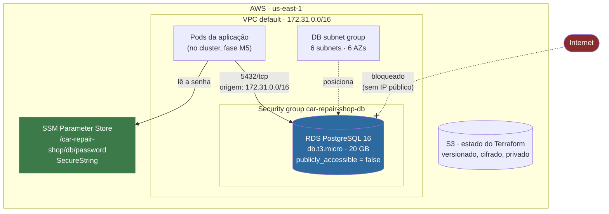

# Infraestrutura do banco gerenciado — Tech Challenge Fase 3

Provisiona o **PostgreSQL gerenciado (Amazon RDS)** que a aplicação da oficina mecânica usa, com
estado remoto, validação automatizada no PR e destruição controlada.

---

## Para que serve

A aplicação precisa de um banco relacional gerenciado, fora do cluster. Este repositório cria esse
banco e **publica o endereço dele** para que os outros repositórios da fase o consumam sem nenhum
valor escrito à mão.

| O que publica | Quem consome |
|---|---|
| `db_endpoint`, `db_port`, `db_name` | aplicação |
| `db_password_parameter` | aplicação, que lê a senha no SSM |
| `db_security_group_id` | repositório do cluster, para liberar os nós |

A leitura é feita por `terraform_remote_state` apontando para o backend descrito abaixo.

## O que este repositório **não** faz

Essa fronteira é deliberada, e saber dela evita procurar coisa no lugar errado:

- **não cria VPC** — consome a default da região
- **não cria cluster Kubernetes** — isso é do repositório de infraestrutura do cluster
- **não cria role de IAM** — o AWS Academy Learner Lab restringe; onde uma role é exigida,
  referencia-se a `LabRole` existente
- **não roda migrações** — o esquema é criado pela aplicação

---

## Arquitetura



**A regra de acesso:** a porta 5432 aceita conexão apenas de dentro da VPC. Não há endereço público.
Verificado nos dois sentidos — de fora dá timeout, de dentro conecta.

O ingress não referencia o security group dos nós do cluster porque isso criaria dependência
circular entre este repositório e o do cluster. A origem é uma variável cujo padrão é o CIDR da VPC.

---

## Tecnologias

| Ferramenta | Versão | Para quê |
|---|---|---|
| Terraform | >= 1.10 | provisionamento |
| Provider AWS | ~> 5.0 | recursos |
| tflint | 0.64 | erros de HCL e de uso do provider |
| trivy | 0.74 | configuração insegura |
| AWS CLI | v2 | credenciais e verificação |

O mínimo do Terraform é 1.10 por causa da trava nativa do S3 (`use_lockfile`), que substituiu a
tabela DynamoDB descontinuada.

---

## Pré-requisitos

### 1. Credencial do Learner Lab

No AWS Academy: **Start Lab**, esperar a bolinha ficar verde, **AWS Details → AWS CLI → Show**, e
colar o bloco em `~/.aws/credentials`.

> A credencial expira em cerca de **4 horas** e o `aws_session_token` muda a cada início de lab.
> Quando algo falhar com erro de token, é isso: repita o passo acima.

### 2. Bucket de estado — criado fora do Terraform

Problema do ovo e da galinha: o Terraform precisa do bucket para guardar o estado, e não pode criá-lo
com o estado que ainda não existe. Uma vez por conta:

```bash
ACCOUNT_ID=$(aws sts get-caller-identity --query Account --output text)
BUCKET="fiap-tech-challenge-tfstate-${ACCOUNT_ID}"

aws s3api create-bucket --bucket "$BUCKET" --region us-east-1
aws s3api put-bucket-versioning --bucket "$BUCKET" \
  --versioning-configuration Status=Enabled
aws s3api put-public-access-block --bucket "$BUCKET" \
  --public-access-block-configuration \
  "BlockPublicAcls=true,IgnorePublicAcls=true,BlockPublicPolicy=true,RestrictPublicBuckets=true"
aws s3api put-bucket-encryption --bucket "$BUCKET" \
  --server-side-encryption-configuration \
  '{"Rules":[{"ApplyServerSideEncryptionByDefault":{"SSEAlgorithm":"AES256"}}]}'
```

O nome leva o ID da conta porque o namespace de bucket do S3 é global — `fiap-tech-challenge-tfstate`
sem sufixo já pertence a outra pessoa.

O versionamento não é enfeite: com estado corrompido, é a única forma de voltar.

### 3. Variáveis obrigatórias

```bash
cp terraform.tfvars.example terraform.tfvars
```

Depois edite os dois valores. Para a senha:

```bash
openssl rand -base64 32
```

`terraform.tfvars` está no `.gitignore` e **não deve ser commitado**.

---

## Execução local

Em repositório de infraestrutura, "rodar local" significa executar o Terraform da sua máquina contra
a AWS de verdade — não há como subir isso em containers no seu computador.

```bash
terraform init                 # conecta no backend S3
terraform plan                 # mostra o que vai mudar; leia antes de aplicar
terraform apply                # cria (o RDS leva cerca de 10 minutos)
terraform output               # endereço, porta, nome do banco
```

Antes de abrir PR, o mesmo ciclo que o CI executa:

```bash
terraform fmt -recursive
terraform validate
tflint --init && tflint
trivy config --severity HIGH,CRITICAL .
python3 scripts/check-no-public-ingress.py
```

---

## Deploy

| Evento | O que roda |
|---|---|
| PR aberto | formato, sintaxe, tflint, trivy, ingress fechado, e o **plano comentado no PR** |
| Merge na `main` | `apply`, depois confere se a instância está `available` e não é pública |
| Botão **Destroy** | `destroy`, com confirmação digitada |

O CI precisa da credencial nos secrets do repositório. Como ela expira em ~4h:

```bash
./scripts/refresh-aws-secrets.sh
```

O script lê `~/.aws/credentials`, **valida antes de publicar** e atualiza os secrets.

A validação de segurança **não** depende de credencial. Quando a chave do lab vence, a revisão perde o
plano, mas o portão continua de pé.

---

## Runbook

### Subir

```bash
terraform init && terraform apply
```

Ou mergear na `main`, que o CD faz. Leva ~10 minutos.

### Obter o endereço

```bash
terraform output db_endpoint
terraform output db_port
```

### Obter a senha

```bash
aws ssm get-parameter --name /car-repair-shop/db/password --with-decryption \
  --query Parameter.Value --output text
```

### Conectar

O banco **não é acessível pela internet**, por projeto. De fora da VPC a conexão dá timeout, e isso é
o comportamento correto, não um defeito. Para conectar é preciso estar dentro da VPC — de um pod do
cluster, ou de uma EC2 na mesma VPC:

```bash
psql "postgresql://$USUARIO:$SENHA@$ENDPOINT:5432/car_repair_shop"
```

### Ver o que está custando

```bash
./scripts/status.sh
```

Varre RDS, EC2, EKS, load balancers, NAT gateways, IPs elásticos ociosos e volumes soltos — a conta
inteira, não só o que este repositório cria, porque o que costuma escapar é o que o Terraform não
gerencia.

### Derrubar

```bash
./scripts/teardown.sh                    # destroy e confere o que sobrou
./scripts/teardown.sh --sweep            # remove também o que o estado não alcançou
./scripts/teardown.sh --include-backend   # remove também o bucket de estado
```

Ou o workflow **Destroy**, digitando `production` na confirmação.

---

## Custo

| Recurso | Por dia | Por mês |
|---|---|---|
| RDS db.t3.micro | ~USD 0,43 | ~USD 13,14 |
| 20 GB de armazenamento | ~USD 0,08 | ~USD 2,30 |

Com o orçamento de USD 50 do Learner Lab, o banco sozinho dura cerca de **3 meses** ligado sem parar.
O gasto cresce muito quando o cluster entra: o control plane do EKS custa USD 0,10/hora, quase cinco
vezes o banco.

**Derrubar entre sessões de trabalho é o que faz o orçamento durar a fase inteira.** Recriar leva ~10
minutos.

> Atenção: **parar não é o mesmo que destruir.** Armazenamento de RDS parado continua sendo cobrado, e
> uma instância parada religa sozinha depois de 7 dias.

---

## Limitação conhecida

**O estado do Terraform guarda a senha do banco em texto claro.** Isso é uma característica do
Terraform, não deste código, e não está resolvido — está contido:

- `.gitignore` cobre `*.tfstate` e `*.tfvars` desde o primeiro commit
- o bucket tem versionamento, cifra AES256 e bloqueio total de acesso público
- o backend usa `encrypt = true`

Pela mesma razão, o comentário de plano no PR usa a saída de **texto**, nunca `terraform show -json`:
o JSON traz a senha em claro, e este repositório é público.

---

## Repositórios relacionados

| Repositório | Papel |
|---|---|
| [fiap-tech-challenge](https://github.com/diandria/fiap-tech-challenge) | a aplicação que consome este banco |

A relação é direta: a aplicação lê `db_endpoint`, `db_port` e `db_name` deste estado para montar a
string de conexão, e busca a senha no parâmetro SSM cujo nome sai em `db_password_parameter`. Sem
este repositório aplicado, a aplicação não sobe.

A documentação da API da aplicação — **Swagger** em `/api-docs` e a coleção do **Postman** em
`postman/` — descreve os endpoints que, no fim, leem e escrevem nas tabelas deste banco.
